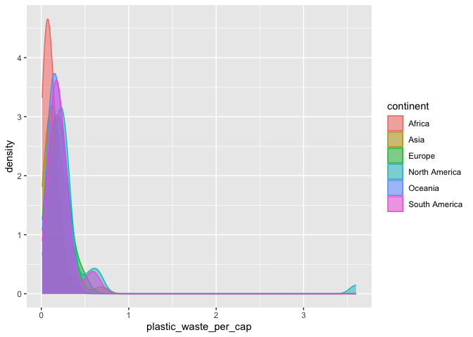
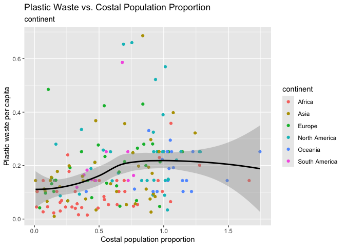

Lab 02 - Plastic waste
================
Steve
04/26/2025

## Load packages and data

``` r
library(tidyverse) 
```

``` r
plastic_waste <- read.csv("data/plastic-waste.csv")
glimpse(plastic_waste)
```

    ## Rows: 240
    ## Columns: 10
    ## $ code                             <chr> "AFG", "ALB", "DZA", "ASM", "AND", "A…
    ## $ entity                           <chr> "Afghanistan", "Albania", "Algeria", …
    ## $ continent                        <chr> "Asia", "Europe", "Africa", "Oceania"…
    ## $ year                             <int> 2010, 2010, 2010, 2010, 2010, 2010, 2…
    ## $ gdp_per_cap                      <dbl> 1614.255, 9927.182, 12870.603, NA, NA…
    ## $ plastic_waste_per_cap            <dbl> NA, 0.069, 0.144, NA, NA, 0.062, 0.25…
    ## $ mismanaged_plastic_waste_per_cap <dbl> NA, 0.032, 0.086, NA, NA, 0.045, 0.01…
    ## $ mismanaged_plastic_waste         <int> NA, 29705, 520555, NA, NA, 62528, 52,…
    ## $ coastal_pop                      <int> NA, 2530533, 16556580, NA, NA, 379004…
    ## $ total_pop                        <int> 31411743, 3204284, 35468208, 68420, 8…

## Exercises

### Exercise 1

Distribution

``` r
ggplot(plastic_waste, aes(x = plastic_waste_per_cap)) + geom_histogram(binwidth = 0.2)
```

    ## Warning: Removed 51 rows containing non-finite outside the scale range
    ## (`stat_bin()`).

<!-- -->

``` r
# finding the outlier
plastic_waste %>%
  filter(plastic_waste_per_cap > 3.5)
```

    ##   code              entity     continent year gdp_per_cap plastic_waste_per_cap
    ## 1  TTO Trinidad and Tobago North America 2010    31260.91                   3.6
    ##   mismanaged_plastic_waste_per_cap mismanaged_plastic_waste coastal_pop
    ## 1                             0.19                    94066     1358433
    ##   total_pop
    ## 1   1341465

### Exercise 2

``` r
ggplot(plastic_waste, aes(x = plastic_waste_per_cap, color = continent, fill = continent)) + geom_density(alpha = 0.5, adjust = 2)
```

    ## Warning: Removed 51 rows containing non-finite outside the scale range
    ## (`stat_density()`).

<!-- -->

### Exercise 3

``` r
ggplot(
  data = plastic_waste,
  mapping = aes(
    x = continent,
    y = plastic_waste_per_cap
  )
) +
  geom_violin()
```

    ## Warning: Removed 51 rows containing non-finite outside the scale range
    ## (`stat_ydensity()`).

<!-- -->

### Exercise 4

``` r
ggplot(plastic_waste, aes(x = plastic_waste_per_cap, y = mismanaged_plastic_waste_per_cap)) + geom_point()
```

    ## Warning: Removed 51 rows containing missing values or values outside the scale range
    ## (`geom_point()`).

<!-- -->

``` r
ggplot(plastic_waste, aes(x = plastic_waste_per_cap, y = mismanaged_plastic_waste_per_cap, color = continent)) + geom_point()
```

    ## Warning: Removed 51 rows containing missing values or values outside the scale range
    ## (`geom_point()`).

<!-- -->

``` r
ggplot(plastic_waste, aes(x = plastic_waste_per_cap, y = total_pop, color = continent)) + geom_point()
```

    ## Warning: Removed 61 rows containing missing values or values outside the scale range
    ## (`geom_point()`).

<!-- -->

``` r
ggplot(plastic_waste, aes(x = plastic_waste_per_cap, y = coastal_pop, color = continent)) + geom_point()
```

    ## Warning: Removed 51 rows containing missing values or values outside the scale range
    ## (`geom_point()`).

<!-- -->

### Exercise 5

``` r
ggplot(plastic_waste %>% filter(plastic_waste_per_cap < 3), aes(y = plastic_waste_per_cap, x = coastal_pop/total_pop, color = continent)) + geom_point() + geom_smooth(aes(group = 1), method = "loess", color = "black", se = TRUE) + labs(x = "Costal population proportion", y = "Plastic waste per capita",  title = "Plastic Waste vs. Costal Population Proportion",
  subtitle = "continent")
```

    ## `geom_smooth()` using formula = 'y ~ x'

    ## Warning: Removed 10 rows containing non-finite outside the scale range
    ## (`stat_smooth()`).

    ## Warning: Removed 10 rows containing missing values or values outside the scale range
    ## (`geom_point()`).

<!-- --> Higher costal
population proportion is associated with higher plastic waster per
capita, but the relationship is not strong
